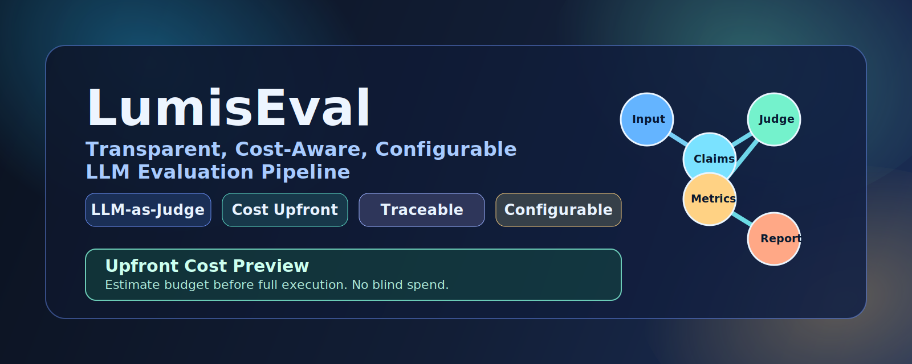

<p align="center">
  
</p>

# LumisEval

[](https://github.com/Sardhendu/lumis-eval/actions/workflows/ci.yml)
[](LICENSE)
[](pyproject.toml)

Agentic LLM evaluation pipeline with cache-aware graph execution, branch-level cost estimation, and declarative reporting.

## Why LumisEval

- Graph-based evaluation nodes (`scan -> chunk -> claims -> metrics -> eval -> report`)
- Per-node cache reuse across runs and estimates
- CLI-first workflow for local files and Hugging Face datasets
- Declarative report projection via `REPORT_VISIBILITY`
- Model routing with global and per-node primary/fallback overrides

## Installation

### Option 1: from local source (recommended for development)

```bash
git clone git@github.com:Sardhendu/lumis-eval.git
cd lumis-eval
pip install -e .
```

### Option 2: from GitHub

```bash
pip install "git+https://github.com/Sardhendu/lumis-eval.git"
```

### Option 3: from PyPI (after publish)

```bash
pip install lumis-eval
```

## Quick Start

```bash
cp .env.example .env
# set OPENAI_API_KEY in .env

lumiseval --help
lumiseval estimate grounding --input sample.json --limit 5
lumiseval run eval --input sample.json --limit 5 --output-dir ./report
```

## CLI Commands

### Estimate uncached branch cost

```bash
lumiseval estimate <target_node> --input <source> [options]
```

### Execute a branch

```bash
lumiseval run <target_node> --input <source> [options]
```

Most used options:
- data: `--input`, `--adapter`, `--split`, `--start`, `--end`, `--limit`
- routing: `--model`, `--llm-model`, `--llm-fallback`
- cache: `--force`, `--no-cache`, `--cache-dir`
- execution: `--max-workers`, `--max-in-flight`, `--continue-on-error`
- output: `--output-dir` (`run`)

## Node Topology

Canonical nodes:
- `scan`
- `chunk`
- `claims`
- `dedup`
- `geval_steps`
- `relevance`
- `grounding`
- `redteam`
- `geval`
- `reference`
- `eval`
- `report`

Dependency highlights:
- `grounding`: `scan -> chunk -> claims -> dedup -> grounding`
- `relevance`: `scan -> chunk -> claims -> dedup -> relevance`
- `geval`: `scan -> geval_steps -> geval`
- `eval`: all prerequisite branches + metric fan-out

## Report Contract

Report is built by `lumiseval_graph.nodes.report.aggregate` using `REPORT_VISIBILITY`.

Always present keys:
- `target_node`
- `input`

Conditionally present keys (omitted if source artifact is `None`):
- `chunks`, `claims`, `claims_unique`, `geval_steps`
- `grounding`, `relevance`, `redteam`, `geval`, `reference`

## Configuration

See `.env.example` for all knobs.

Minimum required for LLM-backed runs:
- `OPENAI_API_KEY`
- `LLM_MODEL` (defaults allowed)

Per-node env overrides are supported:
- `LLM_{NODE}_MODEL`
- `LLM_{NODE}_FALLBACK_MODEL`
- `LLM_{NODE}_TEMPERATURE`

## Development

```bash
uv sync
make lint
make test
make ci
```

## Packaging and Release

Build artifacts:

```bash
uv build
```

You should get:
- `dist/lumis_eval-<version>-py3-none-any.whl`
- `dist/lumis_eval-<version>.tar.gz`

Basic wheel smoke test:

```bash
python -m venv /tmp/lumiseval-venv
source /tmp/lumiseval-venv/bin/activate
pip install dist/*.whl
lumiseval --help
```

## Project Standards

- License: [MIT](LICENSE)
- Security policy: [SECURITY.md](SECURITY.md)
- Contributing guide: [CONTRIBUTING.md](CONTRIBUTING.md)
- Code of conduct: [CODE_OF_CONDUCT.md](CODE_OF_CONDUCT.md)

## Documentation

- [docs/get-started.md](docs/get-started.md)
- [docs/architecture.md](docs/architecture.md)
- [docs/cli-code-flow.md](docs/cli-code-flow.md)
- [docs/execution-model.md](docs/execution-model.md)
